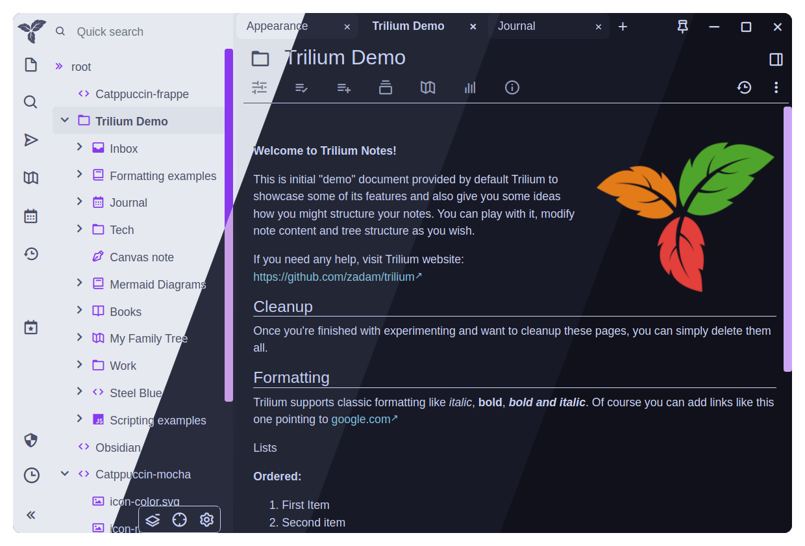
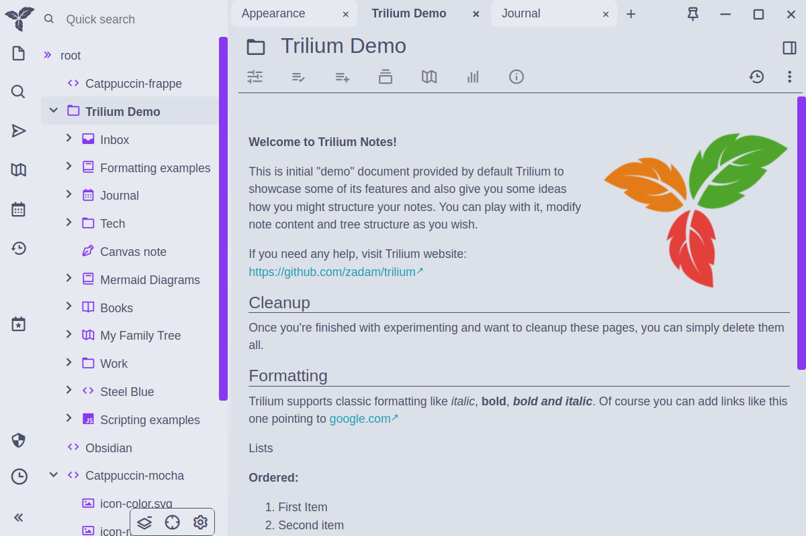
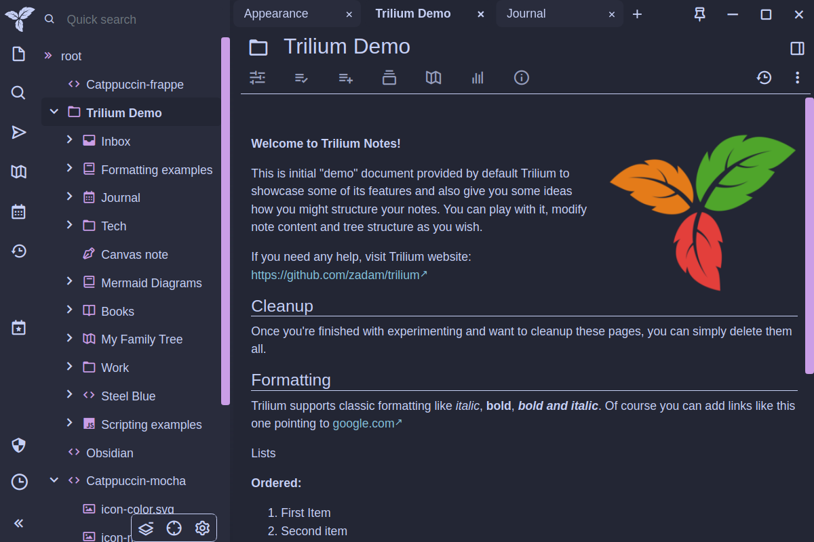
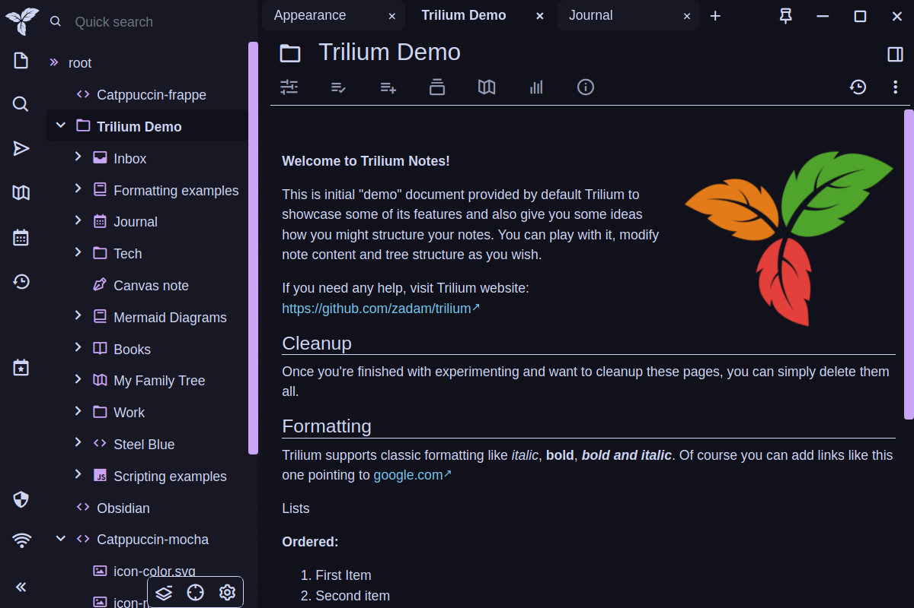

<h3 align="center">
	 
	
	Catppuccin for <a href="https://github.com/TriliumNext/Notes">TriliumNext Notes</a>
	
</h3>

	
	
	

	

## Previews

🌻 Latte

🪴 Frappé

🌺 Macchiato

🌿 Mocha

## Usage

1. Copy the flavor and accent combination of your choice from [`themes/`](./themes/) into a new Trilium **code** note (type: CSS) named "catppuccin-theme".
2. Add a new `#appTheme=catppuccin` attribute to the note (<kbd>Alt</kbd>+<kbd>A</kbd>).
   - You can also use the UI to add the attribute with these settings:
     - Type: `Label`
     - Name: `appTheme`
     - Value: `catppuccin`
     - inheritable: _not ticked_
3. Go to **Menu** > **Options** and select Catppuccinn as your theme.

> [!NOTE]
> Further information and instructions can be found in the [official documentation](https://triliumnext.github.io/Docs/Wiki/themes.html).

## 💝 Thanks to

- [SedAlexa](https://github.com/SadAlexa)
- [NicKoehler](https://github.com/NicKoehler)

&nbsp;

	

	Copyright &copy; 2021-present <a href="https://github.com/catppuccin" target="_blank">Catppuccin Org</a>

	

