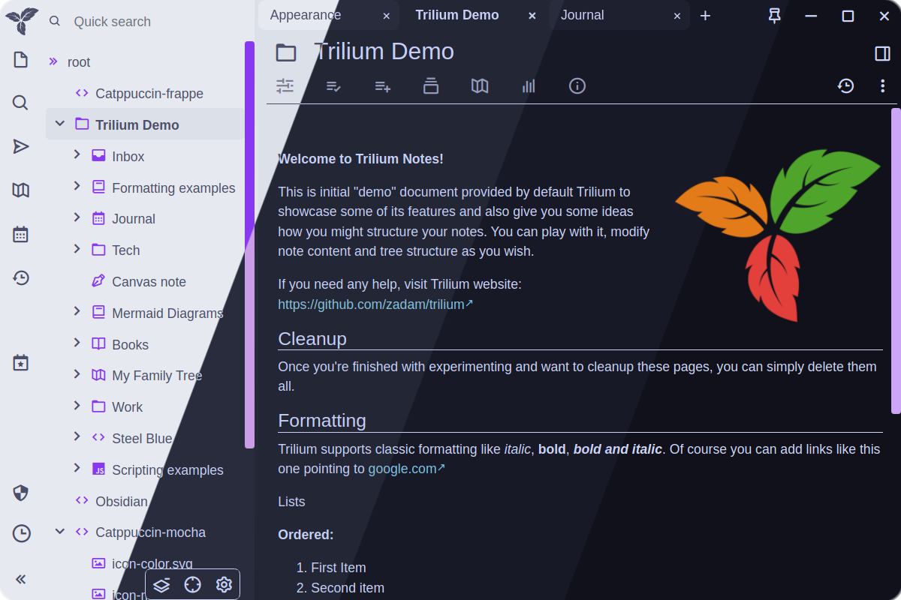

<h3 align="center">
	<br/>
	
	Catppuccin for <a href="https://github.com/zadam/trilium">Trilium Notes</a>
	
</h3>

<p align="center">
	<a href="https://github.com/catppuccin/trilium-notes/stargazers"></a>
	<a href="https://github.com/catppuccin/trilium-notes/issues"></a>
	<a href="https://github.com/catppuccin/trilium-notes/contributors"></a>
</p>

<p align="center">
	
</p>

## Previews

<details>
<summary>🌻 Latte</summary>

</details>
<details>
<summary>🪴 Frappé</summary>

</details>
<details>
<summary>🌺 Macchiato</summary>

</details>
<details>
<summary>🌿 Mocha</summary>

</details>

## Usage

1. Copy the _css_ (**raw**) content of your favorite theme (or from the downloaded file if you used the download script)
2. Paste it into a new Trilium **code** note (type: CSS) named "catppuccin-theme"
3. Add a new attribute to the catppuccin-theme note `(Alt + A)`
    - Either copy & paste `#appTheme=catppuccin` to the node's attributes
    - Or use the UI with these settings
      - Type: Label
      - Name: appTheme
      - Value: catppuccin
      - inheritable: _not ticked_
4. Go to `Menu` > `Options`
5. Select it as your new theme

Further information and instructions can be found in the [official documentation](https://github.com/zadam/trilium/wiki/Themes).

### Change accent color (Optional)

The default **accent color** is _mauve_, if you want to change it, use the download script:

#### Linux
```
sh -c "$(curl -sS https://raw.githubusercontent.com/catppuccin/trilium-notes/main/change-accent.sh)"
```

#### Windows
```
(iwr https://raw.githubusercontent.com/catppuccin/trilium-notes/main/change-accent.ps1).Content | iex
```

## 💝 Thanks to

- [SedAlexa](https://github.com/SadAlexa)
- [NicKoehler](https://github.com/NicKoehler)

&nbsp;

<p align="center">
	
</p>

<p align="center">
	Copyright &copy; 2021-present <a href="https://github.com/catppuccin" target="_blank">Catppuccin Org</a>
</p>

<p align="center">
	<a href="https://github.com/catppuccin/catppuccin/blob/main/LICENSE"></a>
</p>
